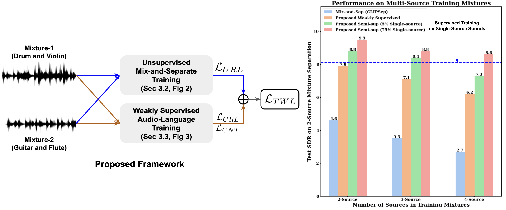

# Weakly Supervised Sound Separation via Bi-Modal Semantic Similarity (ICLR 2024)

## Official PyTorch Implementation

We propose a weakly supervised learning framework for conditional audio separation from natural mixtures (i.e. when no single source sound is available). In particular, we leverage bi-modal semantic similarity (from pre-trained CLAP model) to generate weak supervision on fine-grained source separation without having access to single source sounds. 


> [Tanvir Mahmud](https://sites.google.com/view/tanvirmahmud)*†, [Saeed Ameezadeh](https://www.microsoft.com/applied-sciences/people/saeed-amizadeh)†, [Kazuhito Koishida](https://www.microsoft.com/applied-sciences/people/kazuhito-koishida), [Diana Marculescu](https://users.ece.utexas.edu/~dianam/)<br>

> In ICLR 2024. <span style="font-size: 80%;">(* Work done in part during an internship at Microsoft Corporation, Redmond, USA, † equal contribution)</span><br>


> [WebDemo](https://tanvir-utexas.github.io/BiModalSep-Demo/) | [OpenReview](https://openreview.net/forum?id=4N97bz1sP6) | [arXiv]() <br>


<p align="left"></p>

**(Left)** The proposed conditional audio separation framework. **(Right)** The comparison of our framework and the mix-and-separate baseline in unsupervised and semi-supervised settings.


## Setting Up Environments

```
conda create -n bisep python==3.9.12
conda activate bisep
pip install torch==1.11.0+cu113 torchvision==0.12.0+cu113 torchaudio==0.11.0 --extra-index-url https://download.pytorch.org/whl/cu113
pip install -r requirements.txt

```

## Dataset Preparation

### AudioCaps Dataset
The AudioCaps dataset can be downloaded from [AudioCaps](https://audiocaps.github.io/). We provide AudioCaps captions and parsed sound source phrases [here](https://buetedu-my.sharepoint.com/:u:/g/personal/tanvirmahmud_eee_buet_ac_bd/EcVMKD5h4h1ApmcrkOY3o6YBsqVBqLCph3XkqkLtQcWtXg?e=gKd9g6).  Download this file and put it into "data/audiocaps/annotations" folder. We also provide the script used to parse the sound sources from AudioCaps captions in `preprocessing/audiocaps/parser.py`. Then, use `preprocessing/audiocaps/download_audios.py` script to download all audio files, and put downoladed audios into `data/audiocaps/audio` directory. Afterwards, prepare train and test split ids using `preprocessing/audiocaps/create_split.py`, and put the csv files in `data/audiocaps/annotations` directory.

### VGGSound Dataset
Download audios from [VGGSound](https://www.robots.ox.ac.uk/~vgg/data/vggsound/) dataset, and put in the `data/vggsound/audio` directory. We also provide the sample download script in `preprocessing/vggsound/download_audios.py`. Then, prepare annotation files `test.csv`, and `train.csv` using `preprocessing/vggsound/create_index_files.py`. Afterwards, prepare the test compositions using `preprocessing/vggsound/create_test_composition.py`. Put all annotations in `data/music/annotations` directory.


### Music Dataset
Download videos from [MUSIC](https://github.com/roudimit/MUSIC_dataset/tree/master) dataset, and put in the `data/music/video` directory. Then, extract audios and frames using `extract_audios.py` and `extract_frames.py` provided in `preprocessing/music` directory. Afterwards, prepare `test.csv`, and `train.csv` using the `preprocessing/music/create_index_files.py`. Finally, prepare the test compositions file `test_sep_2.csv` using `preprocessing/music/create_test_composition.py`. Put all annotations in `data/music/annotations` directory.


The data directory should be like this:

```markdown
    Data_Directory/
    ├── AudioCaps/
    │    ├── annotations/
    │    │   ├── parsed_all_caps.json
    │    │   ├── train_ids.csv
    │    │   └── test_sep2_ids.csv
    │    └── audio/
    │        ├── __0Fp4K-2Ew_60.wav
    │        ├── __8O7tZPwsI_20.wav
    │        └── __LerxtZ9ac_0.wav
    |
    ├── MUSIC/
    │    ├── annotations/
    │    │   ├── train.csv
    │    │   ├── test.csv
    │    │   └── test_sep_2.csv
    │    └── audio/
    │        ├── accordion
    │        |   ├── -DlGdZNAsxA.wav
    │        |    └── _jPFkOkNjuo.wav
    │        ├── acoustic_guitar
    │
    ├── VGGSound/
    │    ├── annotations/
    │    │   ├── train.csv
    │    │   ├── test.csv
    │    │   └── test_sep_2.csv
    │    └── audio/
    │        ├── accordion
    │        |   ├── -DlGdZNAsxA.wav
    │        |    └── _jPFkOkNjuo.wav
    │        ├── acoustic_guitar

```


## Training Script

Here, the sample training script are provided for AudioCaps dataset. We also provide scripts for other datasets in `scripts/` directory.

```python
    python main.py --id Proposed_AC --mode train --list_train data/annotations/train_ids.csv \
                    --list_test data/annotations/test_sep2_ids.csv --audio_dir data/audio \
                    --cond_layer sca --num_cond_blocks 1 --num_res_layers 1 --num_head 8 \
                    --cond_dim 768 --num_downs 7 --num_channels 32 --num_mix 2 --audLen 131070 \
                    --audRate 16000 --workers 4 --batch_size 16 --lr 1e-4 --num_epoch 200 \
                    --lr_step 15 --disp_iter 20 --ckpt outputs --multiprocessing_distributed \
                    --ngpu 8 --recons_weight 5 --disp_iter 20 --dist-url tcp://localhost:12341 \
                    --warmup_epochs 1 --eval_epoch 2 --n_sources 3 \
                    --parsed_sources_path data/annotations/parsed_all_caps.json

```

## Test Script

Here, the sample test script are provided for AudioCaps dataset. We also provide scripts for other datasets in `scripts/` directory.

```python
    python main.py --id Proposed_AC --mode test --list_train data/annotations/train_ids.csv \
                    --list_test data/annotations/test_sep2_ids.csv --audio_dir data/audio_16k \
                    --cond_layer sca --num_cond_blocks 1 --num_res_layers 1 --num_head 8 \
                    --cond_dim 768 --num_downs 7 --num_channels 32 --num_mix 2 --audLen 131070 \
                    --audRate 16000 --workers 4 --batch_size 16 --lr 1e-4 --num_epoch 200 \
                    --lr_step 15 --disp_iter 20 --ckpt outputs --multiprocessing_distributed \
                    --ngpu 8 --recons_weight 5 --disp_iter 20 --dist-url tcp://localhost:12341 \
                    --warmup_epochs 1 --eval_epoch 2 --n_sources 3 \
                    --parsed_sources_path data/annotations/parsed_all_caps.json
```


## Demo

### Pre-trained Models
Please download the pretrained models from [model_weights](https://buetedu-my.sharepoint.com/:u:/g/personal/tanvirmahmud_eee_buet_ac_bd/EXuaxZWHMM1KuQCI8hhnhBoBds45jbNNav5Wwh1mWObTfg?e=qhmMtO) and put it in `./pretrained_weights` directory.

You can simply run the demo without setting up the dataset.

```python
    python demo.py  --cond_layer sca --num_cond_blocks 1 --num_res_layers 1 --num_head 8 \
                    --cond_dim 768 --num_downs 7 --num_channels 32 --audLen 131070 \
                    --audRate 16000 --workers 4 --multiprocessing_distributed \
                    --ngpu 1 --dist-url tcp://localhost:12342 --samples_dir demo_samples \
                    --load pretrained_weights/model_weights.pth.tar
```


# Citing
Please cite our paper if you find this repository useful.

```
@inproceedings{mahmud2024weakly,
    title={Weakly-supervised Audio Separation via Bi-modal Semantic Similarity},
    author={Tanvir Mahmud, Saeed Amizadeh, Kazuhito Koishida, and Diana Marculescu},
    booktitle={The Twelfth International Conference on Learning Representations},
    year={2024},
    url={https://openreview.net/forum?id=4N97bz1sP6}
}
```

## Contributing

This project welcomes contributions and suggestions.  Most contributions require you to agree to a
Contributor License Agreement (CLA) declaring that you have the right to, and actually do, grant us
the rights to use your contribution. For details, visit https://cla.opensource.microsoft.com.

When you submit a pull request, a CLA bot will automatically determine whether you need to provide
a CLA and decorate the PR appropriately (e.g., status check, comment). Simply follow the instructions
provided by the bot. You will only need to do this once across all repos using our CLA.

This project has adopted the [Microsoft Open Source Code of Conduct](https://opensource.microsoft.com/codeofconduct/).
For more information see the [Code of Conduct FAQ](https://opensource.microsoft.com/codeofconduct/faq/) or
contact [opencode@microsoft.com](mailto:opencode@microsoft.com) with any additional questions or comments.

## Trademarks

This project may contain trademarks or logos for projects, products, or services. Authorized use of Microsoft 
trademarks or logos is subject to and must follow 
[Microsoft's Trademark & Brand Guidelines](https://www.microsoft.com/en-us/legal/intellectualproperty/trademarks/usage/general).
Use of Microsoft trademarks or logos in modified versions of this project must not cause confusion or imply Microsoft sponsorship.
Any use of third-party trademarks or logos are subject to those third-party's policies.

## Acknowledgement
Our code is based on the implementations of [SoP](https://github.com/hangzhaomit/Sound-of-Pixels), [CLAP](https://github.com/LAION-AI/CLAP), and [CLIPSep](https://github.com/sony/CLIPSep). We used pre-trained audio-language grounding models from [CLAP](https://github.com/LAION-AI/CLAP). We thank the authors for sharing their code. If you use our codes, please also cite their nice works.